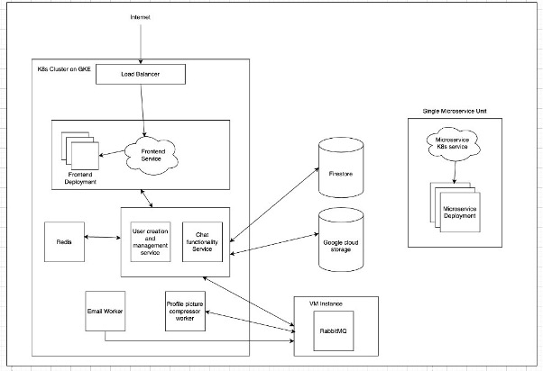

# Study Group Manager – Studious

> **Team Members:**  
> Darshan Vijayaraghavan, Ruban Chakaravarthi, Vignesh Kumar Karthikeyan

---

## Demo Video

  
🔗 [Watch Full Demo](https://www.youtube.com/watch?v=hWxHUJqYAns)

---

## Project Goals

Studious is a cloud-native web application that helps students form and manage study groups easily and efficiently. It supports:

- Student matching based on academic interests and availability
- Creation of online (Zoom) or offline study groups
- Real-time chat and private messaging
- Group event management and reminders
- Email notifications and friend management

---

## Architecture Overview

> **Microservice-based architecture deployed on Google Cloud using Kubernetes**

### Architecture Diagram

### Key Technologies

| Component      | Technology               | Description                                |
| -------------- | ------------------------ | ------------------------------------------ |
| Frontend       | React.js (GKE)           | Dynamic and responsive user interface      |
| Backend        | Node.js + REST API (GKE) | Handles authentication, groups, scheduling |
| Real-time Chat | Socket.IO + Redis (GKE)  | Enables real-time messaging                |
| Async Tasks    | RabbitMQ (GCP VM)        | Background jobs like emails/uploads        |
| Database       | Firestore                | Stores user data, groups, chat logs        |
| Media Storage  | Google Cloud Storage     | Stores profile pictures, documents         |
| Infrastructure | Terraform                | Automates infrastructure provisioning      |
| Orchestration  | Kubernetes (GKE)         | Manages and scales all services            |

---

## System Workflow

1. **User Registration & Authentication** – Signup with email verification, login to dashboard
2. **Study Group Creation** – Online/offline group creation with Zoom links for online
3. **Group Management** – Join, leave, view upcoming events
4. **Chat & Messaging** – Real-time private/group chat via WebSockets + Redis
5. **Email Notifications** – Sent via RabbitMQ workers
6. **Media Uploads** – Profile picture compression and upload to Cloud Storage

---

## Setup Instructions

### Prerequisites

- Google Cloud account
- Terraform Cloud account
- Docker
- Google Cloud SDK (gcloud)
- Kubernetes CLI (kubectl)

---

### 1. Create Service Account in GCP

- IAM & Admin > Service Accounts → Create new
- Assign roles:
  - Compute Admin
  - Kubernetes Engine Admin
  - Firestore Admin
  - Storage Admin
- Download the JSON key

---

### 2. Configure Terraform Cloud

- Go to Terraform Cloud
- Create a workspace
- Upload service account JSON as variable GOOGLE_CREDENTIALS

---

### 3. Deploy Infrastructure with Terraform

Run the following commands:

    cd terraform/
    terraform init
    terraform plan
    terraform apply

---

### 4. Authenticate with Google Cloud CLI

    gcloud auth login
    gcloud config set project [PROJECT_ID]
    gcloud container clusters get-credentials [CLUSTER_NAME] --zone [ZONE]

---

### 5. Deploy Kubernetes Services

    ./deploy-services.sh
    kubectl get services

---

### 6. Configure & Deploy Kubernetes Deployments

    kubectl get services
    # Update .env files with new endpoints

    ./deploy-deployments.sh
    kubectl get deployments

---

### 7. (Optional) Push Docker Images

    docker build -t gcr.io/[PROJECT_ID]/[IMAGE_NAME]:[TAG] .
    docker push gcr.io/[PROJECT_ID]/[IMAGE_NAME]:[TAG]

---

### 8. Install RabbitMQ on VM

    sudo apt-get update
    sudo apt-get install rabbitmq-server -y
    sudo systemctl start rabbitmq-server
    sudo systemctl enable rabbitmq-server
    sudo rabbitmqctl status

---

## Access the Application

    kubectl get services | grep frontend-service

Visit the external IP in your browser to access the Studious platform.

---

## Testing & Debugging

- Integration + regression tests
- Local testing with Minikube
- Logging in backend + workers

  kubectl logs [POD_NAME]

Google Cloud Monitoring used for runtime errors and performance.

---

## Performance & Monitoring

- WebSocket + Redis pub/sub for real-time chat
- RabbitMQ for async job handling
- Kubernetes handles:
  - Auto-scaling
  - Self-healing
  - Rolling updates

---

## Known Limitations

- Steep learning curve for Kubernetes/Terraform
- No CI/CD pipeline (yet)
- Redis + WebSocket scaling needs tuning
- Cost management on cloud services

---

## Future Enhancements

- CI/CD using GitHub Actions or Jenkins
- AI-based group suggestions
- Admin analytics dashboard
- Multilingual and accessibility support
